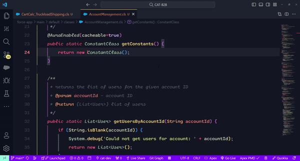
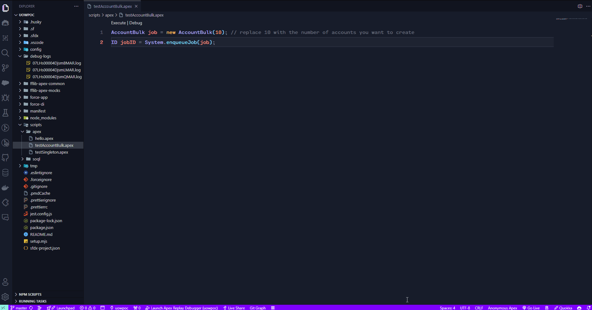
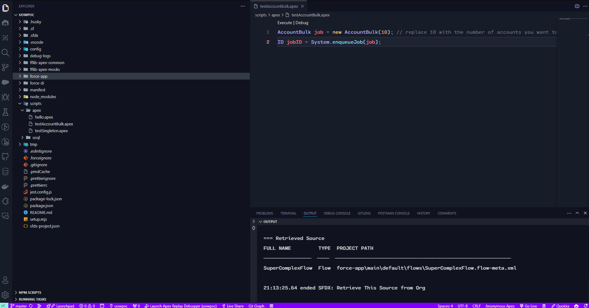
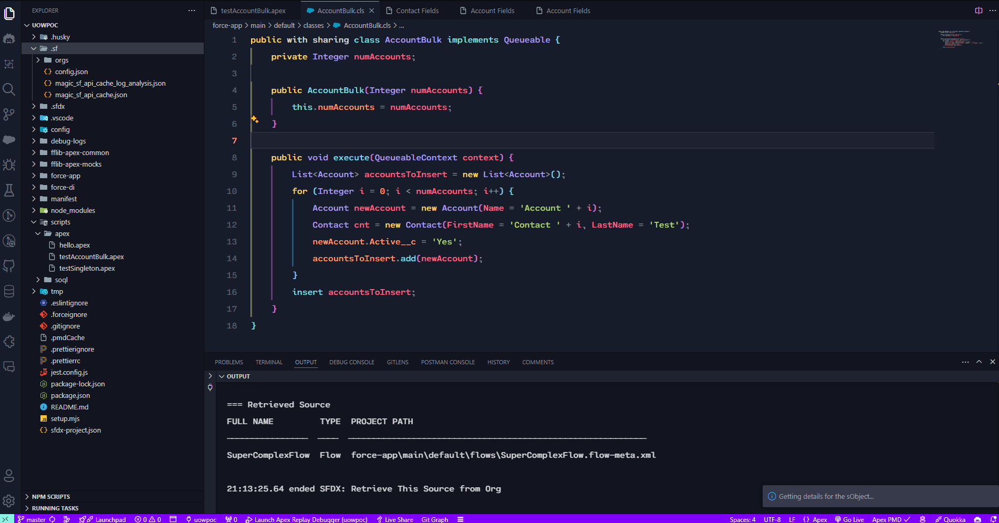

# Salesforce CodeMage - A Salesforce Extension for Salesforce Developers

Salesforce CodeMage enhances the Salesforce development experience by providing direct access to Salesforce orgs' details, opening developer consoles, displaying Salesforce Object (sObject) fields or downloading, reading and managing debug logs.

## Features

- **Show sObject Table** or **Show sObject Table with Selected Text**: Visualize fields of any sObject from your Salesforce org in a table, info like picklist values, required or length of the fields. Use the commands:  
 `magicSF: Show SObject Table` 
 `magicSF: Show SObject Table with Selected Text` 

- **Download Debug Logs**: Download debug logs from your Salesforce org. You can download, reload and filter logs. Since all logs are save in debug-logs you can perform a "global" search in downloaded logs using the vscode search 
`magicSF: Open Debug Logs`  
`magicSF: Delete Debug Logs`  

- **Open Flow in Org**: Open Salesforce flows directly from your local project.
`magicSF: Open Flow in Org` 

- **Open Developer Console**: Quick access to the developer console of your selected Salesforce org.
`magicSF: Open Developer Console` 

- **Apex hover provider for sObjects**: While hovering and sObject in Apex it allows you to see bojects and attributes of those as required or type. 

- **Caching**: All of the above features works with a cache that is stored in the .sf/magic_sf_api_cache or .sf/magic_sf_api_cache_log_analysis, if you need to see any change as new fields you will have to clear the cache using the command: 
`magicSF: clear cache`

## Requirements

For the extension to operate correctly, you need:
- An authenticated Salesforce org. You may want to check your auth hasn't expired (sf org list).
- The Salesforce CLI installed and configured on your machine.
- Access rights to the `.sf/config.json` file in your project's root directory to determine the target Salesforce org. (don't have to do anything 99% time you have this)

## Extension Settings

This extension depends on the following settings:

- `mySalesforceExtension.targetOrg`: Set the default target Salesforce org for your extension operations.

## Installation
You can install this extension using the Visual Studio Code Marketplace or by downloading the latest release from the GitHub repository.

To install this extension:
1. Download the latest release from the [GitHub repository](https://github.com/Teodoro-lab/SalesforceCodeMage).
2. Open Visual Studio Code.
3. Go to Extensions view by clicking on the Extensions icon on the Sidebar.
4. Click on "Install from VSIX..." and select the downloaded file.

## Usage

Once installed, you can use the commands provided by the extension through the command palette:
1. Open the Command Palette (`Ctrl+Shift+P`).
2. Type and select the command you want to execute (e.g., "magicSF: Open Developer Console").

Each command can also be bound to a keyboard shortcut for quicker access.

## Contributing

Contributions are always welcome! I have created a list of future features and enhancements that I would like to implement in the future. If you would like to contribute, please fork the repository and create a pull request.

For recommendations, please open an issue and describe the feature you would like to see implemented.

## License

This project is licensed under the MIT License - see the [LICENSE.md](https://github.com/Teodoro-lab/SalesforceCodeMage/blob/7c62dbb69f5fb59523905e3f936dfbc3cb844052/LICENSE) file for details.
